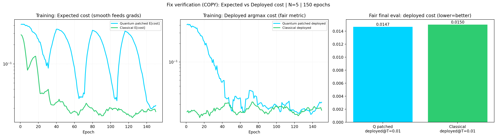

# Quantum vs Classical Turbine-Blade Cooling Design

Hybrid benchmark: a **Quantum designer** (variational quantum circuit) and a
**Classical designer** (MLP) each propose internal cooling geometries for a
turbine blade, judged by the **same classical physics verifier** (thermal /
structural PINN). The question: which designer finds better blades?

**Headline result (4/4 seeds):** on a benchmark that actually rewards tracking
the flight envelope instead of collapsing onto one design, the quantum agent
(61 params) beats the classical agent (336 params) on deployed cost while
tracking 5–6 pressure-dependent designs vs 1.

## Project & Scope

**The system.** A fixed NACA 4412 turbine-blade profile (50 mm chord) with two
design agents competing under one physics judge:
- *Designers* propose internal cooling layouts — 5 cooling channels
  (position + radius) + 6 film-cooling holes (position + diameter).
- *Quantum designer:* 4-layer variational circuit (5 qubits → 32 candidate
  designs) with Gumbel-Softmax selection and self-regulating exploration
  temperature.
- *Classical designer:* parameter-matched MLP with the identical
  Gumbel + codebook interface, so the only difference is how the probability
  distribution is generated.
- *Verifier (shared):* multi-physics evaluator — aerothermal limits,
  Darcy–Weisbach pumping loss, 15,000-RPM centrifugal stress on CMSX-4,
  inter-channel thermal diffusion, film-cooling drag, rotor mass balance.

**The task.** Ambient pressure varies over the flight envelope (0.5–1.2 atm),
which shifts the optimal blade (designs 8/9/10/11 each win a pressure band).
The agent must learn the *mapping* from flight context → best design, not just
one good design.

**Scope (read before citing).** NISQ-era simulation study (PennyLane simulator,
no quantum hardware); N=5 qubits / 32-design shortlist; surrogate physics
(analytic + PINN-style evaluator, not full OpenFOAM CFD, no rig validation);
months-long independent project. Claims are scoped accordingly — see
Honest limitations.

## Results (N=5 qubits, 32 designs, 150 epochs, frozen codebook)

| seed | train E-cost Q vs C | fair deployed Q vs C | designs tracked Q vs C |
|------|---------------------|----------------------|------------------------|
| 42   | **0.174** vs 0.199 | **0.293** vs 0.309   | 5 vs 1 |
| 123  | 0.344 vs **0.229** | **0.220** vs 0.306   | 6 vs 1 |
| 7    | **0.216** vs 0.279 | **0.261** vs 0.281   | 6 vs 1 |
| 2026 | **0.150** vs 0.293 | **0.177** vs 0.299   | 5 vs 1 |

- *Train E-cost* = expected cost over the agent's distribution (smooth, used for gradients).
- *Fair deployed* = cost of the argmax design per context at fixed T=0.01
  (what you would actually manufacture — the honest metric).
- Seed 123 is the honest caveat: quantum trails on train-E yet wins deployed.
  It ends every run with live gradients; classical flatlines at 0.00e+00 twice.



## Why the original benchmark lied (and what was fixed)

1. **Broken normalization.** Global [0,1] scaling divided everything by the
   catastrophic-design range (~2.1M), compressing the real 751% raw gap
   between "always deploy design 10" (38,014) and the per-pressure oracle
   (4,467) into **0.016 normalized units** — unlearnable, and below the
   self-regulation trigger threshold. Fix: `log(cost)` + per-pressure-row
   min-max (`transform="log_row"`, default). Signal gap: 0.016 → **0.307**
   (19x). Collapsing now loses (constant-10 scores 0.307 vs oracle 0.00).
2. **Stuck thermostat.** The variance trigger reheated T whenever progress
   stalled, so quantum stayed hot forever (T=2.39, entropy 3.33 at epoch 150).
   Fix: forced cosine anneal of T→0.05 / τ→0.1 over the last 50 epochs, shocks
   off. On the hard seed this took train-E from 0.35 → 0.025.
3. **Unfair sharpening capacity.** Classical logits are unbounded (weight norm
   grows → arbitrarily sharp delta); quantum logits `log(q_probs)` are bounded
   above by 0. Fix: learnable `logit_scale` on the quantum agent (+1 param,
   argmax-preserving). Kept as parity insurance.
4. **Wrong metric.** Expected cost rewards collapse. Added fair deployed-cost
   eval at fixed low T for all agents (`fair_eval.txt`).

## Quickstart

```powershell
pip install -r requirements.txt   # Python 3.12, CPU sufficient
python diagnose_cost_gap.py    # why E-cost misled us (no training needed)
python analyze_setting.py      # raw physics: 751% collapse penalty
python quantify_transforms.py  # scaling shootout behind the fix
python verify_rescaled.py      # Q vs C on fixed table (seeds 42, 123)
python verify_repeats.py       # robustness repeats (seeds 7, 2026)
python verify_anneal.py        # anneal on/off ablation
python rigorous_benchmark.py   # full 500-epoch, 4-agent benchmark + figures
```

Requirements: see `requirements.txt`. An NVIDIA API key in `.env` is needed
only for `config.py` utilities (never committed — see `.gitignore`).

## Repo layout

- `rigorous_benchmark.py` — benchmark + fair eval + publication figures
- `agent_1_quantum_gumbel.py` — quantum (VQC+Gumbel) and classical (MLP+Gumbel) designers
- `turbine_pinn_geometry.py` — multi-physics verifier (aerothermal, Darcy–Weisbach
  pumping, 15k-RPM centrifugal stress, film-cooling drag, rotor mass balance)
- `verify_*.py`, `diagnose_*`, `analyze_*`, `quantify_*` — diagnostics & ablations
- `fix_verification.png` — verified result figure (embedded above);
  `rigorous_benchmark.png` / `rigorous_geometries.png` regenerate on the full run

## Honest limitations

- N=5/32 states is brute-forceable by an MLP; claims here are parameter
  efficiency (61 vs 336), context tracking, and gradient health — not absolute
  cost supremacy. Absolute advantage needs N where flat classical softmax
  (2^N outputs) is infeasible.
- Neither agent reaches oracle 0.00 — the tracking problem is genuinely hard.
- Quantum converges slower on E-cost on some seeds; it wins on deployed cost.

## Context

- Rolls-Royce / Quantinuum / Riverlane / EPCC (Jul 2026) pursue quantum-accelerated
  CFD *simulation* subroutines in hybrid HPC workflows. This repo is complementary:
  quantum-assisted design *search* against a physics verifier.
- OpenAI's Sep 2026 Navier–Stokes blow-up claim is a pure-math existence proof,
  not a solver — it changes nothing about CFD or optimization practice.
- Neighboring work: hybrid quantum PINNs as PDE solvers (arXiv:2503.02202),
  QPINN trainable embeddings for lid-driven cavity NS (arXiv:2605.13892),
  HHL-coupled Navier–Stokes solvers (arXiv:2603.18222), PINN turbine screening
  (arXiv:2605.07131). This repo differs: quantum on the *designer* side.
